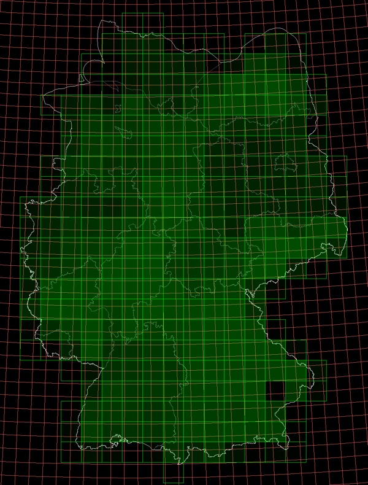
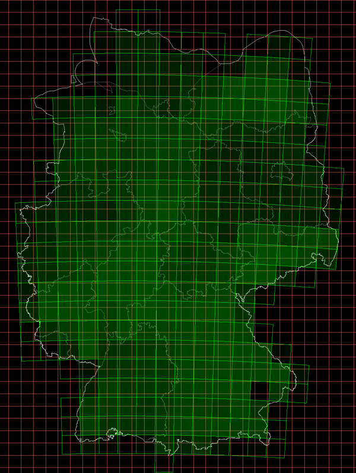
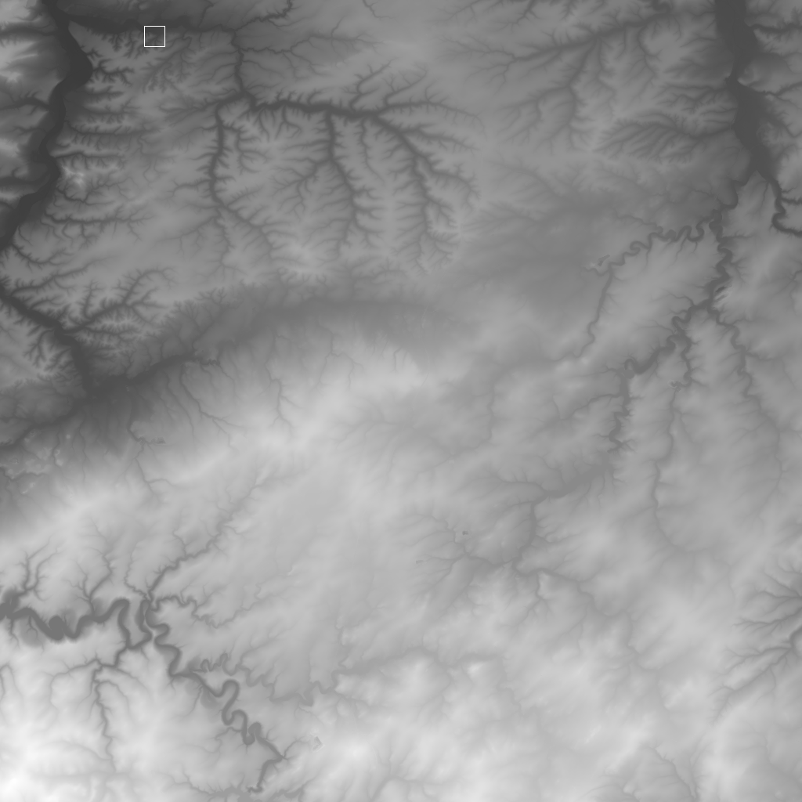
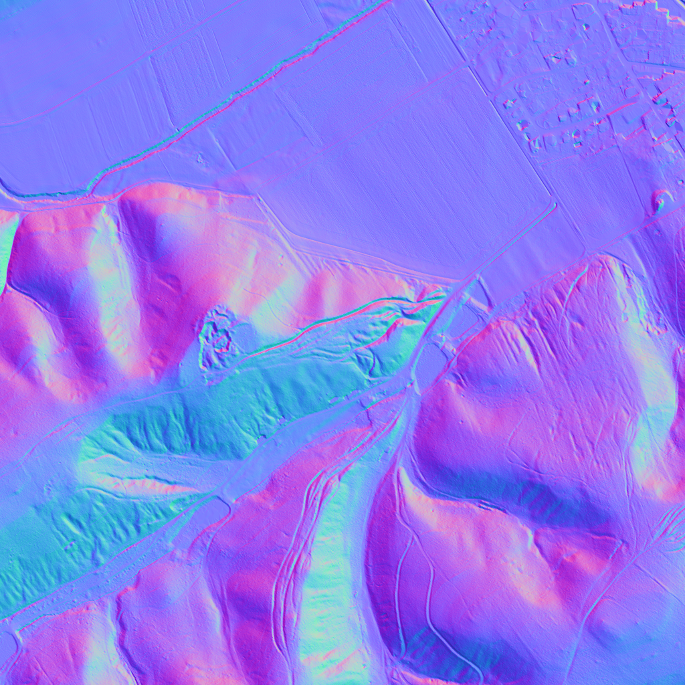

# map raster-tiles from openDTM data

The fantastic https://www.opendem.info provides us with a unified terrain grid over germany,
collected from open data of each federal state.

The resolution is pretty good (1 pixel ~= 1m²) and this leads to a couple of challenges.

There are 281 GeoTiff files, each at ~40,000² pixels, each compressed inside a zip.

Downloading all zips requires: 820 GB

Extracting those zips requires: 1.6 TB 

Reprojecting it to web-mercator map tiles and calculating normal maps requires another 3 Tb (estimated)

Here's the map of all provided sectors in EPSG:25832 projection. The opaqueness reflects the 
file size of each zip file, ranging between 7 MB and 5 GB. The red grid shows the position of 
web-mercator map tiles at zoom level 10.

Here's the same map in web-mercator projection (EPSG:3857):

For another impression of the size of this dataset, look at this 1024² downsampled version of sector E680N5600.
The small rectangle is cropped below at highest resolution and a normal-map is calculated to enhance the
visibility of details.

## Current approach

I want to reproject the 40,000² DTM sectors into typical web-mercator tiles at 256². 
To gain maximum resolution, the window size inside the DTM sector should be approximately 256².

Below is a list of map-tile resolutions that would result for different zoom levels.
The resolutions are minimum and maximum, since tile resolutions are a little different for each DTM sector.

    zoom  1: 13,831,678 x 19,995,929 - 13,831,678 x 19,995,929
    zoom  2: 16,817,554 x 9,564,058  - 16,817,554 x 9,564,058
    zoom  3:  3,802,618 x 3,299,783  -  3,802,618 x 3,299,783
    zoom  4:  1,894,705 x 1,727,497  -  1,894,705 x 1,727,497
    zoom  5:    823,746 x 799,082    -    972,309 x 968,352
    zoom  6:    393,226 x 392,205    -    454,879 x 453,497
    zoom  7:    192,100 x 191,699    -    219,735 x 219,117
    zoom  8:     94,239 x 94,053     -    111,781 x 111,473
    zoom  9:     47,132 x 47,038     -     56,370 x 56,216
    zoom 10:     23,453 x 23,407     -     28,305 x 28,227
    zoom 11:     11,727 x 11,704     -     14,152 x 14,113
    zoom 12:      5,863 x 5,852      -      7,083 x 7,064
    zoom 13:      2,933 x 2,927      -      3,540 x 3,530
    zoom 14:      1,466 x 1,463      -      1,770 x 1,765
    zoom 15:        733 x 732        -        884 x 882
    zoom 16:        366 x 366        -        442 x 441
    zoom 17:        183 x 183        -        221 x 220
    zoom 18:         91 x 91         -        110 x 110
    zoom 19:         45 x 45         -         55 x 55
    zoom 20:         22 x 22         -         27 x 27

Seems like it would be worth the trouble to go up to zoom level 17.

TODO: 

- a gap in normal map at about 20/557441/351617, for reproject:13@3600²
- alignment with map is not correct in the lower-right area of the OpenDTM slices
